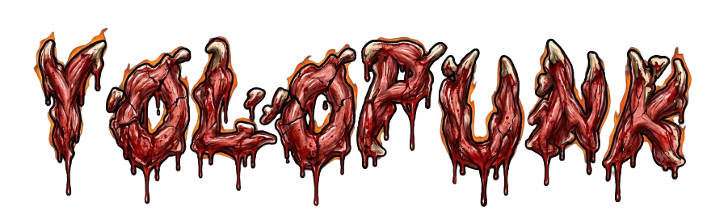

<div align="center">


###### _sǝɐ̰ɥןɐƃɐW ˙Ɔ ˙ᗡ ɐɹoɹn∀ - 5202/11/52 ǝpsǝp soʇuıɹıqɐן sop ɐsɐɔ ɐu opuɐɹʇuƎ_

 


</div>

##  𝐌𝐀𝐍𝐈𝐅𝐄𝐒𝐓𝐎 DO CÓDIGO
**YOLOPunk** é o anti-framework.  
O código foi escrito com o objetivo de perpetuar o formato ergodico antes do conteudo.  
Aqui, a visão da máquina é barroca, **um espaço reverso** onde não há clareira, só corredores.

- Não prometa simplicidade; abrace a carne excêntrica da complexidade.
- Documente cada paço que tiver antes que se perca.
- Não fuja daquilo que parece impossível: corrompa, inquiete, desoriente.
- Teste tudo, mas desconfie de tudo.
**Entre. Perca-se.**

---

##  GRIMÓRIO ERGÓDICO (Documentação)

**A documentação vive. Sangra. Converge.**

### 📖 Acesse o Grimório

👉 **[yolopunk.github.io](https://crise-ergodica.github.io/yolopunk)** 👈

Ou construa localmente:

```bash
# Instale dependências
pip install -r requirements-docs.txt

# Sirva localmente com live reload
mkdocs serve

# Acesse: http://127.0.0.1:8000
```

### 🎨 Features da Documentação

- **Tema Ergódico Customizado** - Vermelho sangue com design moderno
- **Templates Jinja2** - Controle total sobre cada elemento
- **Componentes Reutilizáveis** - Cards, heroes, footers, admonitions
- **Dark Mode Nativo** - Modo claro e escuro com cores harmônicas
- **Mobile Responsive** - Perfeito em qualquer dispositivo
- **Busca Inteligente** - Encontre qualquer informação rapidamente
- **Code Highlighting** - Syntax highlighting para Python, YAML, Bash

### 📚 Estrutura do Grimório

- **Início** - Overview do projeto
- **Grimório** - Documentação profunda
  - Sinopse - Introdução à filosofia ergódica
  - Modo Treino - Pipeline completa de treinamento
  - Modo Validação - Métricas e análise de erros
- **API Reference** - Referência completa da API
- **Exemplos** - Quick start, componentes, customização Jinja2

### 🛠️ Customização

Veja [docs/README.md](docs/README.md) para guia completo de customização.

**Quick customização CSS:**

```css
/* docs/stylesheets/custom.css */
.md-typeset h1 {
  color: var(--yp-blood-red);
  border-bottom: 2px solid var(--yp-blood-red);
}
```

**Quick customização Jinja2:**

```jinja2
<!-- docs/overrides/main.html -->



  <!-- Seu conteúdo aqui -->
  {{ super() }}

```

---

##  ESTRUTURA DO 𝙔𝙊𝙇𝙊𝙋𝙐𝙉𝙆

```plaintext
yolopunk/
│
├── yolopunk/
│   └── ...
│
├── tests/                      # IMPORTANTE: seus testes vão aqui!
│   ├── __init__.py
│   ├── test_module1.py
│   └── ...
│
├── docs/                       # Documentação MkDocs (Grimório Ergódico)
│   ├── index.md                # Página inicial
│   ├── grimorio/               # Documentação profunda
│   ├── api/                    # Referência da API
│   ├── exemplos/               # Exemplos práticos
│   ├── overrides/              # Templates Jinja2 customizados
│   ├── stylesheets/            # CSS customizado
│   ├── javascripts/            # JavaScript interativo
│   ├── README.md               # Guia da documentação
│   └── DEVELOPMENT.md          # Guia de desenvolvimento
│
├── .github/                    
│   └── ISSUE_TEMPLATE/         # Templates para 'issues'
│   └── workflows/              # Automação de CI/CD
│       ├── ci.yml
│       ├── format.yml
│       └── docs.yml            # Deploy automático da documentação
│
├── .gitignore                  # Arquivos que o Git ignora
├── LICENSE                     # Licença do projeto
├── pyproject.toml              # CRUCIAL: configurações do projeto
├── mkdocs.yml                  # Configuração do MkDocs
├── requirements-docs.txt       # Dependências da documentação
└── README.md                   # Você está aqui!
```

---

##  ЯIƬӨ DE INSTALAÇÃO

INCOMPLETO

---

##  PRIMEIRO 𝙲𝙾𝙽𝚃𝙰𝚃𝙾

INCOMPLETO

---

##  CONFIGURE O OꓕNIꓤIꓭⱯꓶ

O framework não é suave — é um _labirinto de folhas_.  
Cada parâmetro pode abrir uma porta… ou trancar você na sala errada.

Veja o arquivo `pyproject.toml` para livros de receitas proibidas.  
Exemplo de configuração:

---

##  NOTAS

- Tudo documentado em `docs/`, mas é prudente duvidar.
- Leia tudo com uma lanterna (e um sal).
- Código amaldiçoado é melhor documentado, ou então some do repositório com ruídos.

---

##  CONTRIBUA _ˢᵉ ᵒᵘˢᵃʳ_

Para adicionar seus próprios demônios,  
- Faça um **fork**
- Crie uma **branch** do seu ritual (`feature/aberracao`)
- Faça um commit que doa nos outros (`git commit -m '💀 feat: miragem de pose'`)
- Abra um PR. O sangue será avaliado.

Aceitamos contribuições que desafiem a razão e a sanidade. Testes são bem-vindos, e docstrings protegem dos horrores.

**Para contribuir com a documentação:**

1. Edite arquivos em `docs/`
2. Teste localmente: `mkdocs serve`
3. Commit e push - GitHub Actions faz deploy automático

---

## ️ LICENÇA

**AGPL-3.0**: Compartilhe. Sangre. Corrompa novamente.  
O que é derramado aqui, nunca mais retorna limpo.

---

<div align="center">

## O FRAMEWORK É O LABIRINTO  
#### _Você não decifra, você se perde._

[](https://github.com/Crise-Ergodica/yolopunk/pulls)
[](https://www.python.org/)
[](https://crise-ergodica.github.io/yolopunk)


</div>
